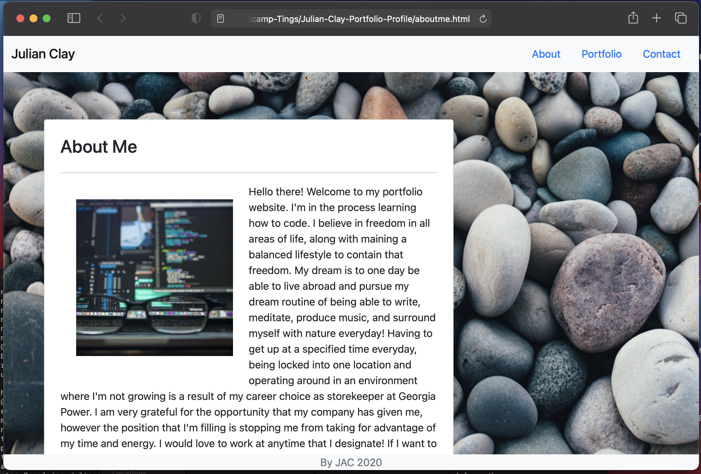

# Julian Clay's Portfolio Website

## JAC Portfolio Website Link
https://jaclay1994.github.io/Client-Website-Assessability/

## Goals

* Using Bootstrap to replace a majority of manual CSS.
* Making the content responsive to different screen sizes.
* 

## Summary

* Creating my portfolio website from scratch started with created a navigation bar. Then I proceeded to add a responsive background image.
After that, I came across an issue of the container form blocking the view from the background and it became a problem since it was hindering
the background image from actually covering the whole screen. Adding a margin to the container fixed this issue. There were some other solution that I could have used, however this is the solution that I ended up sticking with. After adding content to its respective page,
I added a sticky footer to the bottom, following a similar styling for the navigation bar. Linking the pages was not difficult for me to do since Bootstrap lays out the places to write out code to customize its interations with the pages. This activity really showed me that I can
create a decent looking website that can display the information I'm trying to present. I would like to further at button functionality on the contact page and look forwrard to that skill being added in the next week. Adding different navigation responsiveness was not difficult when I figured out what code I needed to copy. I would like to obtain a deeper understanding of how these blocks are created from CSS and javascript, but that will come with time. 

